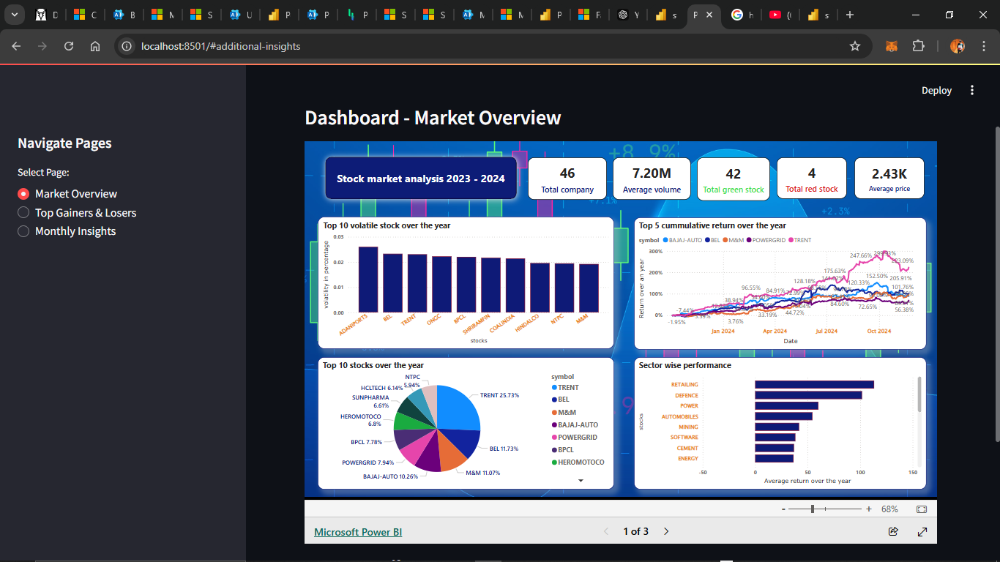
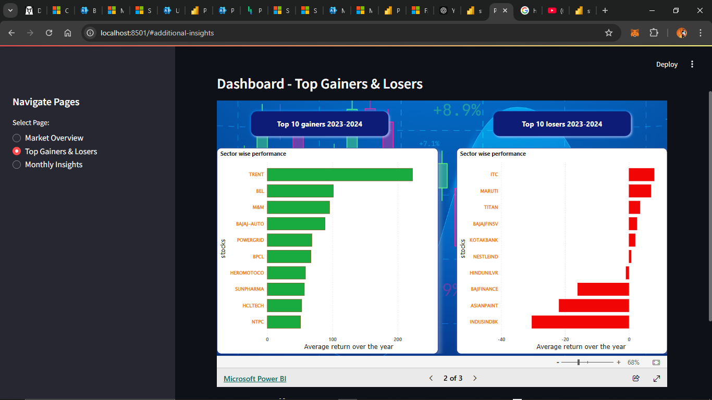
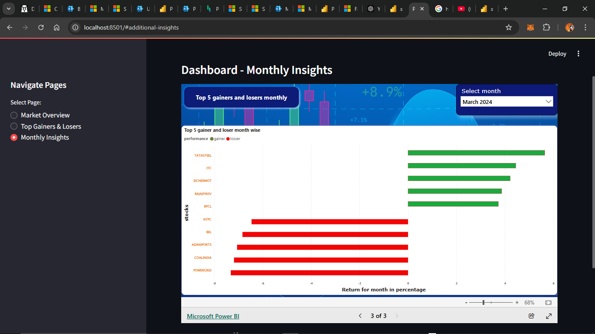

# **Stock Market Analysis and Visualization**

This project performs **stock market analysis** using various technologies to provide insightful visualizations and data-driven insights. It includes functionalities like **data collection**, **processing**, and **interactive visualization** through tools like **Power BI** and **Streamlit**.

---

## **How to Use the Application**

### **1. Data Analysis**
Analyze stock performance metrics, including:
- **Daily Returns**
- **Cumulative Returns**
- **Monthly Returns**
- **Yearly Returns**

Data is categorized into **gainers** and **losers** for a clear understanding of market trends.

### **2. Interactive Dashboard**
A **Power BI dashboard** is designed to display interactive visuals for:
- **Top 5 Gainers and Losers for Each Month**  
- Dynamic **slicers and filters** for in-depth data exploration.

### **3. Streamlit Integration**
The **Streamlit application** embeds the Power BI dashboard for seamless access to insights, including:
- Additional options for **filtering data**.
- Selecting specific stocks for analysis.

---

## **Screenshots**

Below are screenshots of the project for better understanding:

### **Power BI Dashboard**
#### Market details


### **Streamlit Application**
#### Embedded Power BI Dashboard


### **Streamlit Application**
#### Embedded Power BI Dashboard


---

## **Technologies Used**

- **Python**: Core programming language for data processing and application development.
- **Pandas**: For efficient data manipulation and preparation.
- **Power BI**: For creating dynamic and interactive visualizations.
- **Streamlit**: To integrate and host an interactive web application.

---

## **Installation**

To run this project locally, follow these steps:

### **Clone the Repository**
```bash
git clone https://github.com/YourUsername/StockMarketAnalysis.git

### **Run application**
```bash
streamlit run stockanalysis.py


